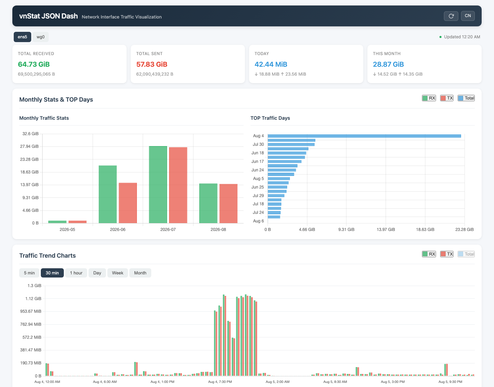
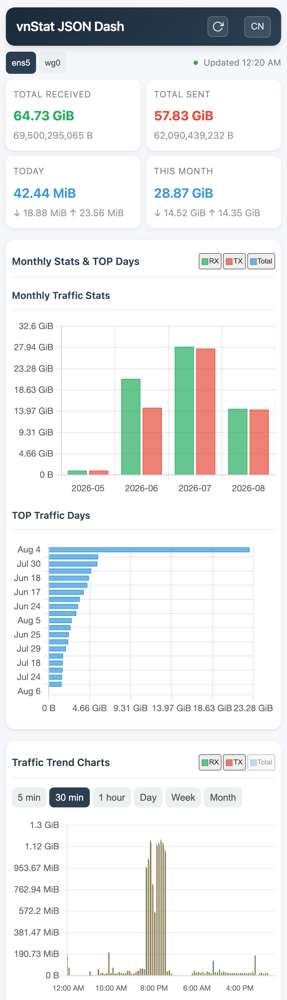

# vnstat-json-dash

[简体中文](README.zh-CN.md) | English

An unofficial, dependency-free static JSON publisher and web dashboard for
[vnStat](https://github.com/vergoh/vnstat).

`vnstat-json` reads a vnStat 2.x SQLite database in read-only mode, atomically
publishes browser-friendly JSON snapshots, and serves them through a static
dashboard. It does not expose Prometheus metrics, run an application server,
or replace `vnstatd`.

## Features

- Standard-library-only Python publisher (Python 3.6+)
- Read-only SQLite access
- Atomic JSON writes and a non-blocking advisory lock
- Five-minute, half-hour, hourly, daily, weekly, monthly, yearly, and top views
- Multiple-interface support
- Responsive Chinese/English dashboard with light/dark themes and chart zoom
- Hardened systemd oneshot service and timer
- No PHP, Node.js, database migration, or package build required

## Screenshots

Screenshots use live data with the 30-minute traffic dimension selected.

### Desktop (1440 x 900)



### Mobile (390 x 844, DPR 3)



## Requirements

- vnStat 2.x with a readable SQLite database
- Python 3.6 or newer
- A static web server such as nginx, Caddy, or Apache to publish the dashboard
- Linux with systemd for the provided timer (cron can be used instead)

The default paths are `/var/lib/vnstat/vnstat.db` for the database and
`/var/lib/vnstat/json` for the generated dashboard files. Values from
`/etc/vnstat.conf` are honored, including `Database`, `DatabaseDir`,
`JsonExportDir`, and `UseUTC`.

## Quick install

The installer places the command in `/usr/local/bin`, dashboard assets in
`/var/lib/vnstat/json`, and systemd units in `/etc/systemd/system`:

```bash
curl -fsSL https://raw.githubusercontent.com/vuecwiz/vnstat-json-dash/main/install.sh | sudo bash
```

The systemd service runs as `vnstat:vnstat`. If your distribution uses a
different account for the vnStat database, update `User=` and `Group=` in
`/etc/systemd/system/vnstat-json.service`.

To install from a downloaded GitHub Release package, extract the ZIP and run:

```bash
sudo ./install.sh
```

To uninstall the command, systemd units, dashboard assets, and generated JSON:

```bash
sudo ./install.sh --uninstall
```

Verify the publisher:

```bash
sudo systemctl status vnstat-json.timer
sudo systemctl start vnstat-json.service
ls -l /var/lib/vnstat/json/vnstat_index.json
```

Serve `/var/lib/vnstat/json` as a static directory. A minimal nginx server is:

```nginx
server {
    listen 80;
    server_name _;
    root /var/lib/vnstat/json;
    index index.html;

    location / {
        try_files $uri $uri/ =404;
    }
}
```

The dashboard itself has no authentication. Add access control or restrict the
listener before exposing host traffic statistics to the public internet.

## Run from a checkout

```bash
git clone https://github.com/vuecwiz/vnstat-json-dash.git
cd vnstat-json-dash

./scripts/vnstat-json \
  --dbfile /var/lib/vnstat/vnstat.db \
  --output /var/lib/vnstat/json

sudo install -m 0644 www/* /var/lib/vnstat/json/
```

To read paths and timezone behavior from vnStat's configuration:

```bash
./scripts/vnstat-json --config /etc/vnstat.conf
```

Useful options:

```text
-d, --dbfile PATH       vnStat SQLite database
-o, --output PATH       JSON output directory
-c, --config PATH       vnStat configuration file
-i, --interface NAME    publish only one interface
    --lock-file PATH    override the advisory lock path
-v, --verbose           print each exported interface
```

For cron-based systems:

```cron
1-59/5 * * * * vnstat /usr/local/bin/vnstat-json --config /etc/vnstat.conf
```

The provided timer runs at minutes 01, 06, 11, and so on, shortly after the
usual vnStat five-minute database commit boundary.

## Output

For each interface, the publisher atomically writes a complete snapshot under
each dimension filename:

```text
vnstat_<interface>_fiveminute.json
vnstat_<interface>_halfhour.json
vnstat_<interface>_hour.json
vnstat_<interface>_day.json
vnstat_<interface>_week.json
vnstat_<interface>_month.json
vnstat_<interface>_year.json
vnstat_<interface>_top.json
vnstat_index.json
```

Files are mode `0644` by default and remain readable by an unprivileged web
server. Overlapping timer or cron invocations exit successfully without doing
duplicate work.

## Repository layout

```text
scripts/vnstat-json       SQLite-to-JSON command
install.sh                installer and uninstaller (remote or local package)
systemd/                  oneshot service and timer
www/                      self-contained static dashboard
```

## Contributing and security

Bug reports and focused pull requests are welcome. Keep Python changes
compatible with Python 3.6+ and standard-library-only operation. Report
security issues privately through
[GitHub Security Advisories](https://github.com/vuecwiz/vnstat-json-dash/security/advisories/new),
and do not include private traffic data or credentials in public issues.

## License

Project code is released under the [MIT License](LICENSE). The bundled
[Chart.js 4.4.1](https://github.com/chartjs/Chart.js),
[chartjs-plugin-zoom 2.0.1](https://github.com/chartjs/chartjs-plugin-zoom),
and [Hammer.js 2.0.7](https://github.com/hammerjs/hammer.js) libraries retain
their upstream MIT licenses and copyright headers.

vnStat is a separate project licensed under GPL-2.0. This project is not
affiliated with or endorsed by the vnStat maintainers.
