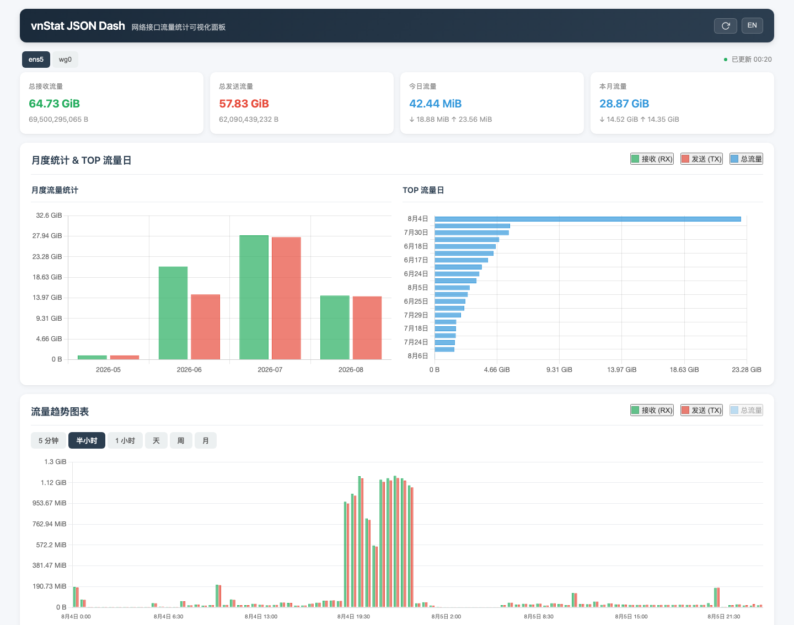
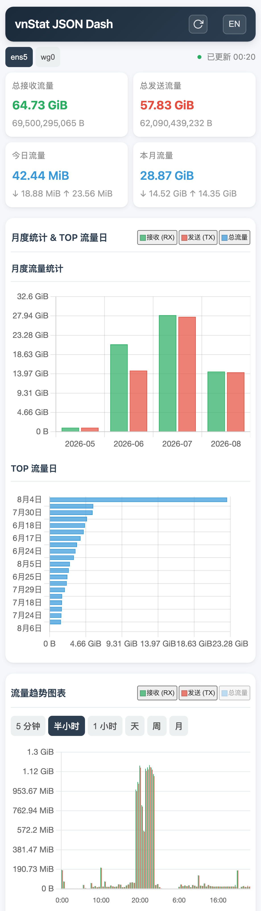

# vnstat-json-dash

简体中文 | [English](README.md)

一个非官方、无第三方运行时依赖的
[vnStat](https://github.com/vergoh/vnstat) 静态 JSON 发布器与 Web 仪表盘。

`vnstat-json` 以只读方式访问 vnStat 2.x SQLite 数据库，原子生成便于浏览器读取的
JSON 快照，并通过纯静态页面展示流量数据。它不提供 Prometheus 指标，不运行应用
服务器，也不会替代 `vnstatd`。

## 功能

- 仅使用 Python 标准库，支持 Python 3.6+
- 以只读方式访问 SQLite 数据库
- 原子写入 JSON，并使用非阻塞文件锁防止任务重叠
- 支持 5 分钟、半小时、小时、天、周、月、年和 TOP 流量视图
- 支持多个网络接口
- 中英文响应式仪表盘，支持明暗主题和图表缩放
- 提供经过安全加固的 systemd oneshot 服务和定时器
- 不需要 PHP、Node.js、数据库迁移或软件包构建

## 界面截图

截图使用真实数据，流量趋势图表统一选择“半小时”维度。

### 桌面端（1440 x 900）



### 手机端（390 x 844，DPR 3）



## 环境要求

- vnStat 2.x，以及当前用户可读取的 SQLite 数据库
- Python 3.6 或更高版本
- nginx、Caddy 或 Apache 等静态 Web 服务器
- 使用提供的定时器时需要 Linux 和 systemd；也可以改用 cron

默认数据库路径为 `/var/lib/vnstat/vnstat.db`，默认输出目录为
`/var/lib/vnstat/json`。程序会读取 `/etc/vnstat.conf` 中的 `Database`、
`DatabaseDir`、`JsonExportDir` 和 `UseUTC` 等配置。

## 一行安装

安装器会把命令安装到 `/usr/local/bin`，把仪表盘资源安装到
`/var/lib/vnstat/json`，并把 systemd 单元安装到 `/etc/systemd/system`：

```bash
curl -fsSL https://raw.githubusercontent.com/vuecwiz/vnstat-json-dash/main/install.sh | sudo bash
```

systemd 服务默认以 `vnstat:vnstat` 身份运行。如果系统使用其他账户访问 vnStat
数据库，请修改 `/etc/systemd/system/vnstat-json.service` 中的 `User=` 和
`Group=`。

如需使用 GitHub Release 中下载的安装包，请解压 ZIP 后执行：

```bash
sudo ./install.sh
```

卸载命令、systemd 单元、仪表盘资源和已生成的 JSON：

```bash
sudo ./install.sh --uninstall
```

验证安装：

```bash
sudo systemctl status vnstat-json.timer
sudo systemctl start vnstat-json.service
ls -l /var/lib/vnstat/json/vnstat_index.json
```

将 `/var/lib/vnstat/json` 作为静态目录发布。最小 nginx 配置示例：

```nginx
server {
    listen 80;
    server_name _;
    root /var/lib/vnstat/json;
    index index.html;

    location / {
        try_files $uri $uri/ =404;
    }
}
```

仪表盘自身不提供身份认证。如果要将流量信息暴露到公网，请先配置访问控制或限制
监听地址。

## 从源码运行

```bash
git clone https://github.com/vuecwiz/vnstat-json-dash.git
cd vnstat-json-dash

./scripts/vnstat-json \
  --dbfile /var/lib/vnstat/vnstat.db \
  --output /var/lib/vnstat/json

sudo install -m 0644 www/* /var/lib/vnstat/json/
```

使用 vnStat 配置文件中的路径和时区设置：

```bash
./scripts/vnstat-json --config /etc/vnstat.conf
```

主要参数：

```text
-d, --dbfile PATH       vnStat SQLite 数据库路径
-o, --output PATH       JSON 输出目录
-c, --config PATH       vnStat 配置文件
-i, --interface NAME    只发布指定网络接口
    --lock-file PATH    自定义任务锁文件
-v, --verbose           输出每个已处理的接口
```

不使用 systemd 时，可以每五分钟通过 cron 执行：

```cron
1-59/5 * * * * vnstat /usr/local/bin/vnstat-json --config /etc/vnstat.conf
```

提供的 timer 会在每小时的 01、06、11 分等时间运行，避开 vnStat 常见的五分钟
数据库提交时间点。

## 输出文件

程序为每个网络接口原子写入以下文件：

```text
vnstat_<interface>_fiveminute.json
vnstat_<interface>_halfhour.json
vnstat_<interface>_hour.json
vnstat_<interface>_day.json
vnstat_<interface>_week.json
vnstat_<interface>_month.json
vnstat_<interface>_year.json
vnstat_<interface>_top.json
vnstat_index.json
```

文件默认权限为 `0644`，普通 Web 服务用户可以读取。timer 或 cron 任务重叠时，后
启动的任务会安全退出，不会重复写入。

## 项目结构

```text
scripts/vnstat-json       SQLite 到 JSON 的发布命令
install.sh                支持远程或本地安装及卸载的脚本
systemd/                  oneshot 服务和定时器
www/                      自包含静态仪表盘
```

## 贡献与安全

欢迎提交问题和目标明确的 Pull Request。Python 修改应保持兼容 Python 3.6+，同时
只使用标准库。安全问题请通过
[GitHub Security Advisories](https://github.com/vuecwiz/vnstat-json-dash/security/advisories/new)
私下报告；不要在公开 Issue 中提交私有流量数据或凭据。

## 许可证

项目代码使用 [MIT License](LICENSE)。随项目分发的
[Chart.js 4.4.1](https://github.com/chartjs/Chart.js)、
[chartjs-plugin-zoom 2.0.1](https://github.com/chartjs/chartjs-plugin-zoom) 和
[Hammer.js 2.0.7](https://github.com/hammerjs/hammer.js) 保留其上游 MIT
许可证及版权标头。

vnStat 是使用 GPL-2.0 许可证的独立项目。本项目与 vnStat 维护者没有从属关系，
也不代表获得其官方认可。
